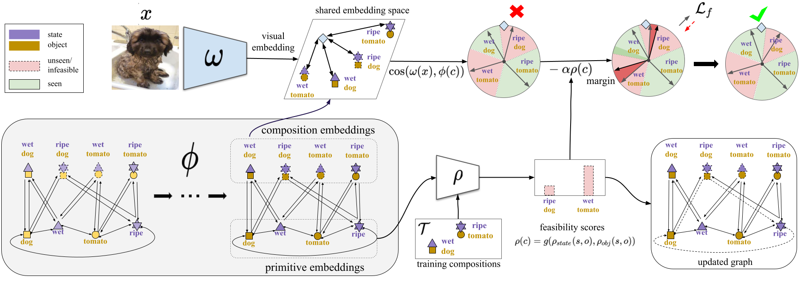

# Compositional Cosine Graph Embeddings (Co-CGE)
This is the official PyTorch code of the T-PAMI 2022 paper [Learning Graph Embeddings for Open World Compositional Zero-shot Learning](https://arxiv.org/pdf/2105.01017.pdf).

**Note:** Most of the code is borrowed from https://github.com/ExplainableML/czsl.

<p align="center">
  
</p>

## Setup 

1. Clone the repo 

2. We recommend using Anaconda for environment setup. To create the environment and activate it, please run:
```
    conda env create --file environment.yml
    conda activate czsl
```

3. Go to the cloned repo and open a terminal. Download the datasets and embeddings, specifying the desired path (e.g. `DATA_ROOT` in the example):
```
    bash ./utils/download_data.sh DATA_ROOT
    mkdir logs
```


## Training
To train Co-CGE for OW-CZSL, the command is simply:
```
    python train.py --config configs/co-cge/CONFIG_FILE --fast_eval 
```
where `CONFIG_FILE` is the path to the configuration file of the model. We suggest to use the `fast_eval` flag to speed up the test phase.

Note that the folder `configs` contains configuration files for Co-CGE and all other methods, i.e. CGE in `configs/cge`, CompCos in `configs/compcos`, and the other methods in `configs/baselines`.  

To train for OW-CZSL a non-open world method, just add `--open_world` after the command. E.g. for running SymNet in the open world scenario on Mit-States, the command is:
```
    python train.py --config configs/baselines/mit/symnet.yml --open_world
```
**Note 1:** Not all methods are compatible with the `fast_eval` (e.g. SymNet is one)
**Note 2:** To create a new config, all the available arguments are indicated in `flags.py`. 

## Test
 

**Closed World.** To test a model, the code is simple:
```
    python test.py --logpath LOG_DIR
```
where `LOG_DIR` is the directory containing the logs of a model.

**Open World.** To test a model in the open world setting, run:
```
    python test.py --logpath LOG_DIR --open_world --fast_eval
```

To test a model trained for OW-CZSL in the closed setting, run:
```
    python test.py --logpath LOG_DIR --open_world --fast_eval --closed_eval
```


## References
If you use this code, please cite
```
@inproceedings{mancini2022learning,
  title={Learning Graph Embeddings for Open World Compositional Zero-shot Learning},
  author={Mancini, M and Naeem, MF and Xian, Y and Akata, Zeynep},
  booktitle={IEEE Transactions on Pattern Analysis and Machine Intelligence},
  year={2022},
  organization={IEEE}
}
```